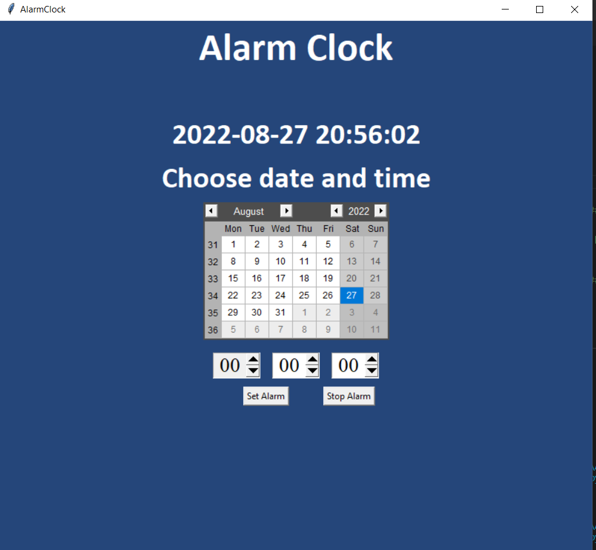

# AlarmClock

A small python alarm clock. In the short future, I want to add more functionality to it (e.g. adding your own alarm sound, snooze...).

##### Libraries used:
- pygame
- datetime
- time
- sqlite3
- threading
 

 
